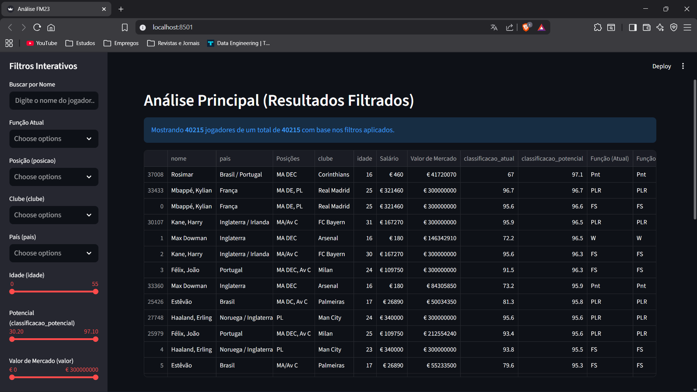
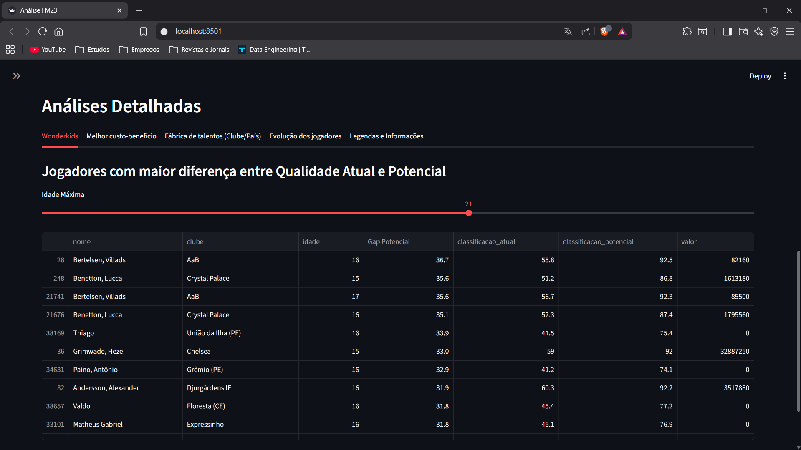
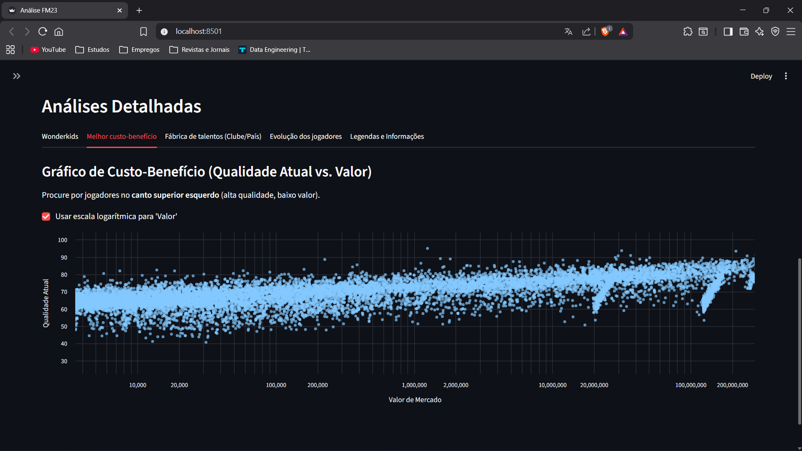
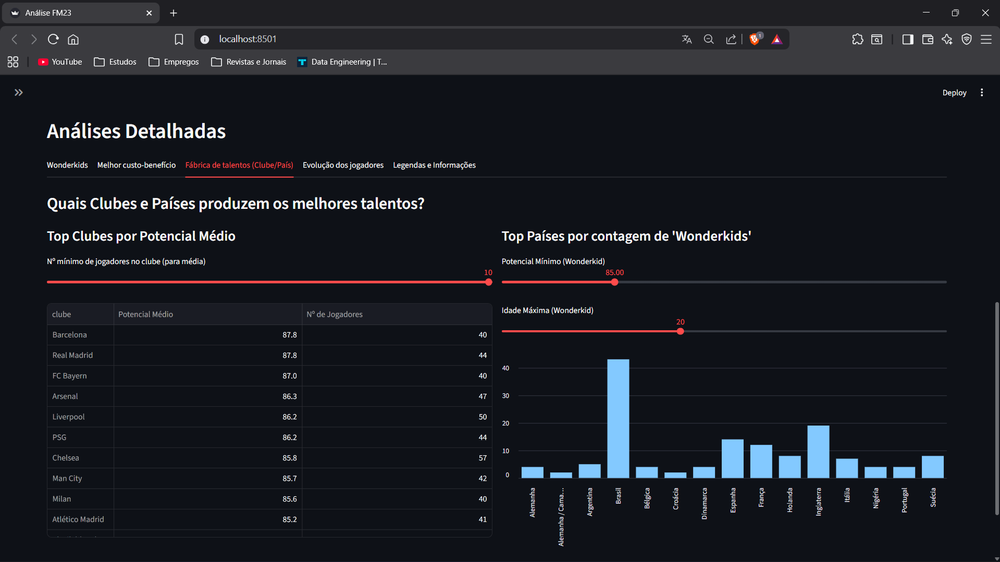
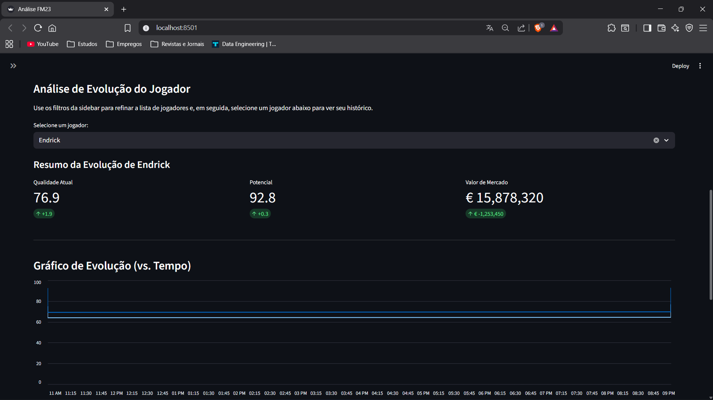
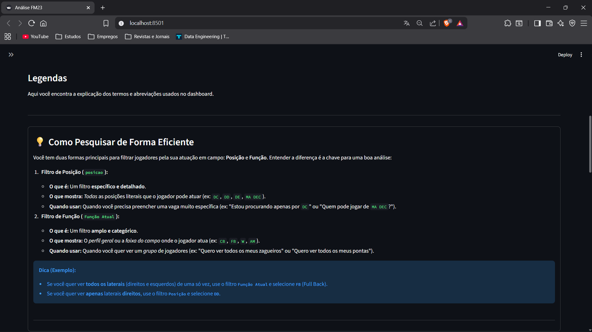
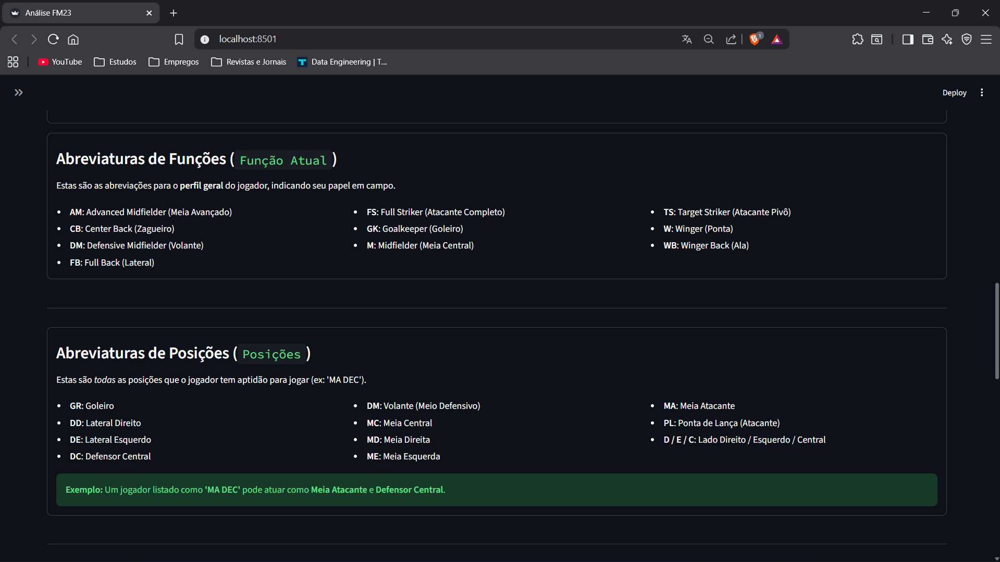
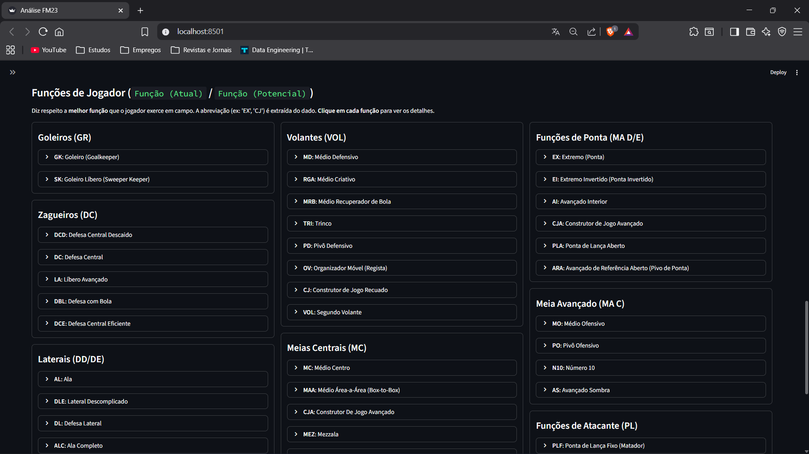
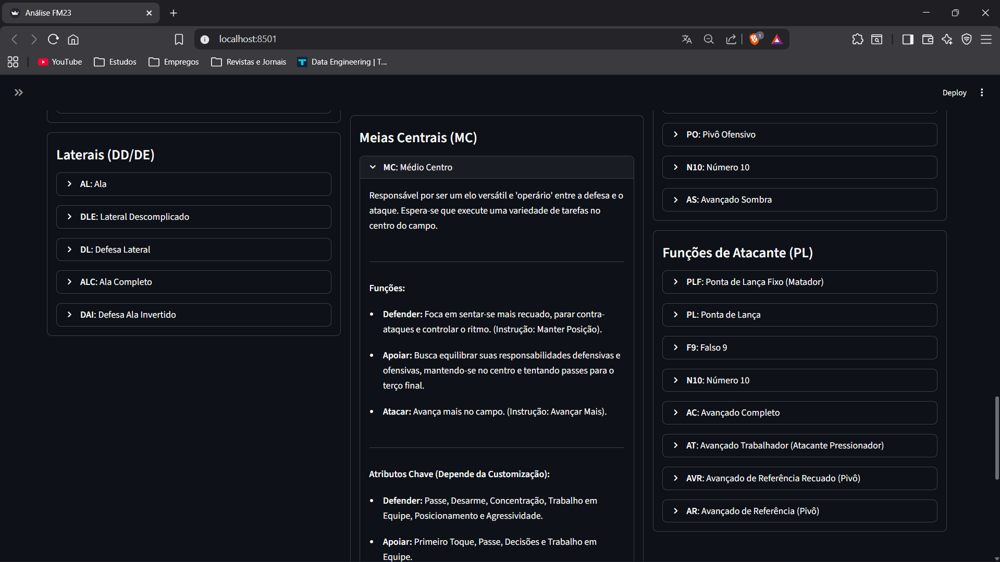

<a id="readme-top"></a>

<!-- LINKEDIN HEADER SHIELD -->

[![LinkedIn][linkedin-shield]][linkedin-url]

<!-- PROJECT INTRO -->
<br />
<div align="center">
  
  <h3 align="center">Análise de jogadores | Football Manager 2023</h3>
  
  <p align="center">
    Um pipeline completo para analisar e entender o cenário do mundo de futebol no seu save do FM23!
    <br />
    <a href="https://youtu.be/QQNmT_7c4rI"><strong>Demonstração »</strong></a>
    <br />
    <br />
  </p>

</div>

<!-- TABELA DE CONTEÚDOS -->
<details>
  <summary>Tabela de conteúdos</summary>
  <ol>
    <li>
      <a href="#sobre-o-projeto">Sobre o projeto</a>
      <ul>
        <li><a href="#desenvolvido-com">Desenvolvido com</a></li>
      </ul>
    </li>
    <li>
      <a href="#como-usar">Como usar</a>
      <ul>
        <li><a href="#pré-requisitos">Pré-requisitos</a></li>
        <li><a href="#instalação">Instalação</a></li>
      </ul>
    </li>
    <li><a href="#exemplo-de-uso">Exemplo de uso</a></li>
    <li><a href="#licença">Licença</a></li>
    <li><a href="#contato">Contato</a></li>

  </ol>
</details>

<!-- SOBRE O PROJETO -->

## Sobre o Projeto

Um pipeline ETL completo em Python para processar dados de jogadores (exportados via Genie Scout em .CSV). O projeto garante a segurança e integridade dos dados por meio de etapas de limpeza e transformação, armazenando-os em um banco SQLite. A análise e visualização final são feitas por um dashboard interativo construído com Streamlit.

<p align="right">(<a href="#readme-top">back to top</a>)</p>

### Desenvolvido com

Este projeto foi desenvolvido com as seguintes tecnologias:

[![Python][python-shield]][python-url]
[![Streamlit][streamlit-shield]][streamlit-url]
[![Pandas][pandas-shield]][pandas-url]

<p align="right">(<a href="#readme-top">back to top</a>)</p>

<!-- COMO USAR -->

## Como usar

Siga os passos abaixo para configurar e executar o projeto localmente.

### Pré-requisitos

Antes de tudo, certifique-se de ter o seguinte instalado:

- **Python 3.8+** (verifique com `python --version`)
- **Genie Scout** (`para a extração dos dados`).

### Instalação

**Preparação dos dados (Extract)**

1. O pipeline depende de um arquivo de dados específico.
2. Salve o arquivo exportado no formato .CSV e coloque-o em data/.

**1. Clone este repositório:**

```bash
git clone https://github.com/Cabana021/football-manager-data-analysis
cd football-manager-data-analysis
```

**2. Instale as dependências Python:**

```bash
pip install -r requirements.txt
```

**3. Execute o pipeline**

Este é o passo que irá ler o seu arquivo .CSV, realizar a limpeza e transformação dos dados, e carregá-los no banco de dados SQLite (Load).

```
python pipeline.py
```

**4. Acessar o Dashboard (Análise)**

Com o banco de dados preenchido, você pode iniciar a aplicação Streamlit para visualizar os resultados.

```
streamlit run app.py
```

<p align="right">(<a href="#readme-top">back to top</a>)</p>

<!-- EXEMPLO DE USO -->

## Exemplo de uso

📈 Tela principal



<p>A imagem exibe a tela principal desenvolvido com Streamlit, focado na análise dos dados carregados pelo pipeline ETL. No painel esquerdo, são apresentados diversos Filtros Interativos (Nome, Posição, Clube, Idade, Potencial e Valor de Mercado), que permitem ao usuário refinar e segmentar o conjunto de dados. A tabela central exibe os resultados filtrados, comprovando que o pipeline foi bem-sucedido na ingestão de mais de 40 mil jogadores, tornando o dashboard uma ferramenta eficaz para scouting e análise de dados no Football Manager.</p>

<p align="right">(<a href="#readme-top">back to top</a>)</p>

📈 Wonderkids



<p>"Esta imagem apresenta a seção de Análises Detalhadas do dashboard, especificamente a aba focada em "Wonderkids". O objetivo principal desta visualização é identificar jogadores jovens com a maior margem de evolução. Para isso, o sistema permite filtrar a busca por uma Idade Máxima (configurada em 21 anos no exemplo) e exibe uma tabela ordenada pela métrica "Gap Potencial". Esta métrica representa a diferença entre a Classificação de Potencial e a Classificação Atual do jogador, destacando os talentos com maior potencial de crescimento e valor de mercado futuro.</p>

<p align="right">(<a href="#readme-top">back to top</a>)</p>

📈 Gráfico de Custo-Benefício



<p>Esta seção do dashboard, intitulada "Melhor Custo-benefício", apresenta uma análise gráfica crucial para a tomada de decisão no scouting. O gráfico de dispersão plota a Qualidade Atual dos jogadores (eixo Y) contra o Valor de Mercado (eixo X). A opção de escala logarítmica para 'Valor' é utilizada para melhor distribuição visual e foco em jogadores com valores de mercado mais baixos. Para encontrar jogadores bons e baratos, atente-se aos dados no canto superior esquerdo, onde se encontram os jogadores de Alta Qualidade com Baixo Valor de Mercado, representando o melhor custo-benefício.</p>

<p align="right">(<a href="#readme-top">back to top</a>)</p>

📈 Fábricas de Wonderkids



<p>Esta seção das Análises Detalhadas permite investigar a origem dos melhores talentos. A tela é dividida em duas análises principais: à esquerda, é apresentada a tabela "Top Clubes por Potencial Médio", que lista os clubes com a maior média de potencial entre seus jogadores, permitindo ajustar o número mínimo de jogadores considerados para o cálculo. À direita, o gráfico de barras "Top Países por contagem de Wonderkids" exibe a distribuição geográfica dos jovens talentos, utilizando sliders para definir o Potencial Mínimo e a Idade Máxima considerados na contagem, oferecendo insights sobre quais países são os principais celeiros de jovens promissores.</p>

<p align="right">(<a href="#readme-top">back to top</a>)</p>

📈 Evolução do jogador



<p>Esta imagem exibe a tela da seção de Evolução de Jogador. Esta área do dashboard é destinada a plotar o histórico de variação de métricas de um jogador específico ao longo do tempo. No estado atual, o jogador analisado foi o Endrick, que melhorou seu nível atual e potencial, além do valor de mercado</p>

<p align="right">(<a href="#readme-top">back to top</a>)</p>

📈 Legendas



<p>Esta imagem corresponde à aba de "Legendas" do dashboard, que tem a função de fornecer documentação e guias de uso para o usuário.</p>

📈 Legendas



<p>Nesta aba temos duas seções: Funções e posições. Cada seção apresenta as siglas e seus significados, com destaque visual e um exemplo final ilustrando como interpretar as posições.</p>

📈 Legendas



<p>Seção com uma lista organizada de funções de jogador no FM23, separadas por setores como goleiros, zagueiros, laterais, volantes, meias e atacantes. Cada bloco apresenta as funções disponíveis dentro daquela posição, com suas siglas e nomes completos.</p>

📈 Legendas



<p>O bloco de Médio Centro está expandido e exibe a descrição completa da função, incluindo responsabilidades em campo, variações como defender, apoiar e atacar, além dos atributos-chave esperados para cada papel.</p>

### Ideias de melhorias

Algumas sugestões do que você pode contribuir:

- 📊 Criar relatórios em PDF ou CSV
- ⚙️ Implementar interface gráfica (GUI)
- 🌐 Suporte para outros idiomas
- 🛡️ Melhorias na segurança e tratamento de erros

### Encontrou um bug?

Abra uma [issue](https://github.com/Cabana021/football-manager-data-analysis/issues) descrevendo o problema, e vamos resolver juntos!

**Obrigado por ajudar a tornar este projeto ainda melhor!**

<p align="right">(<a href="#readme-top">back to top</a>)</p>

<!-- LICENÇA -->

## Licença

Este projeto está sob a licença **Unlicense** - isso significa que ele é de **domínio público** e você pode fazer o que quiser com ele!

Sinta-se livre para:

- ✅ Usar comercialmente
- ✅ Modificar e adaptar
- ✅ Distribuir
- ✅ Usar em projetos privados

**Sem nenhuma restrição ou necessidade de atribuição.**

<p align="right">(<a href="#readme-top">back to top</a>)</p>

<!-- CONTATO -->

## Contato

Criado por: **Victor Cabana**. Sinta-se à vontade para me contatar:

[![LinkedIn][linkedin-shield]][linkedin-url]

[![Email][email-shield]][email-url]

<p align="right">(<a href="#readme-top">back to top</a>)</p>

<!-- MARKDOWN LINKS & IMAGES -->

[linkedin-shield]: https://img.shields.io/badge/-LinkedIn-black.svg?style=for-the-badge&logo=linkedin&colorB=0077B5
[linkedin-url]: https://www.linkedin.com/in/victor-cabana-simoes/
[email-shield]: https://img.shields.io/badge/Email-D14836?style=for-the-badge&logo=gmail&logoColor=white
[email-url]: mailto:vcabanadev@gmail.com
[python-shield]: https://img.shields.io/badge/Python-3776AB?style=for-the-badge&logo=python&logoColor=white
[python-url]: https://www.python.org/
[streamlit-shield]: https://img.shields.io/badge/Streamlit-FF4B4B?style=for-the-badge&logo=streamlit&logoColor=white
[streamlit-url]: https://streamlit.io/
[pandas-shield]: https://img.shields.io/badge/Pandas-150458?style=for-the-badge&logo=pandas&logoColor=white
[pandas-url]: https://pandas.pydata.org/
